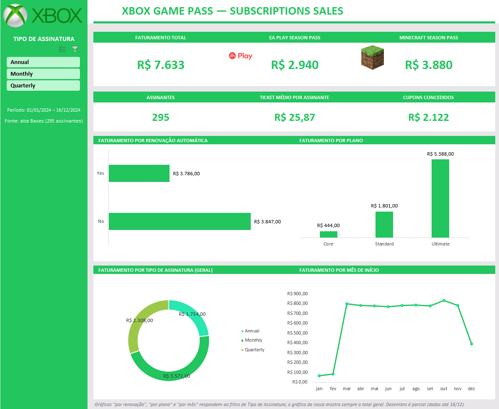

# 🎮 Dashboard de Vendas — Xbox Game Pass Subscriptions

Projeto do desafio de Excel da DIO: transformar dados brutos de assinaturas do Xbox Game Pass em um **dashboard de vendas** visual e interativo, construído com **tabelas dinâmicas, gráficos dinâmicos e segmentação de dados**.

## 🎯 Objetivo

Organizar e visualizar os dados de vendas para responder rapidamente perguntas como:

- Quanto a empresa faturou no total e quantos assinantes tem?
- Qual o faturamento dos passes adicionais (**EA Play** e **Minecraft**)?
- Qual a diferença de faturamento entre quem tem e quem não tem **renovação automática**?
- Qual plano (Core, Standard ou Ultimate) e qual tipo de assinatura (Monthly, Quarterly ou Annual) mais vendem?
- Como o faturamento evoluiu ao longo dos meses?

## 📁 Conteúdo do repositório

| Arquivo | Descrição |
|---|---|
| `dashboard_xbox.xlsx` | Pasta de trabalho com o dashboard concluído |
| `assets/preview_dashboard.png` | Imagem do dashboard |
| `README.md` | Este documento |

## 📊 Dados utilizados

Base fornecida pelo curso (aba **Bases**, formatada como tabela `Tabela1`): **295 assinantes**, com início entre **01/01/2024 e 16/12/2024**.

| Coluna | Descrição |
|---|---|
| Subscriber ID | Identificador do assinante |
| Name | Nome do assinante |
| Plan | Plano: Core, Standard ou Ultimate |
| Start Date | Data de início da assinatura |
| Auto Renewal | Renovação automática (Yes/No) |
| Subscription Price | Preço do plano |
| Subscription Type | Tipo: Monthly, Quarterly ou Annual |
| EA Play Season Pass / Price | Contratou o EA Play? Valor |
| Minecraft Season Pass / Price | Contratou o Minecraft? Valor |
| Coupon Value | Valor do cupom de desconto |
| Total Value | Valor total da venda |

## 🔁 Como reproduzir

1. Abra o arquivo `dashboard_xbox.xlsx` no Excel.
2. A aba **Bases** tem os dados; as tabelas dinâmicas ficam na aba **Calculos** (oculta) e alimentam o **Dashboard**.
3. Para refazer do zero: cole a base em uma aba, transforme em tabela (Ctrl+T) e crie tabelas dinâmicas em Inserir > Tabela Dinâmica.
4. Crie gráficos dinâmicos a partir das tabelas e cole no Dashboard.
5. Insira a segmentação de dados de *Subscription Type* e conecte às tabelas (Conexões de Relatório).
6. Aplique as cores: verde `#22C55E` e fundo cinza `#E8E6E9`.
   
## ⚠️ Observações

- Os dados de dezembro de 2024 vão só até 16/12, por isso a queda no último ponto do gráfico mensal.
- Janeiro e fevereiro têm poucas vendas na base.
- Logos de Xbox, EA Play e Minecraft pertencem aos seus respectivos titulares e foram fornecidos no material do desafio, usados apenas para fins educacionais.

## 🛠️ Ferramentas

Microsoft Excel: tabelas, tabelas dinâmicas, gráficos dinâmicos e segmentação de dados.

## 👩‍💻 Autora

**Helen** — [github.com/Helenh12](https://github.com/Helenh12)
